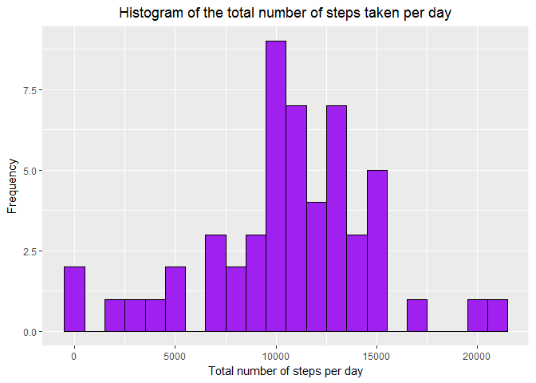
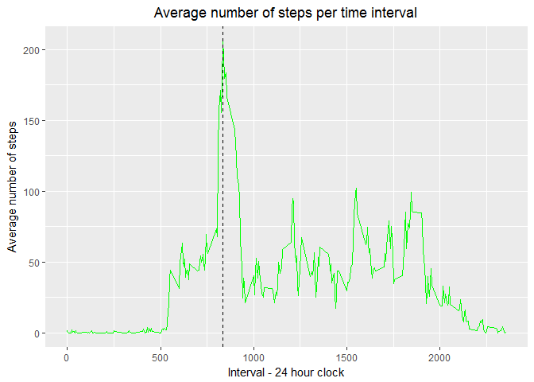
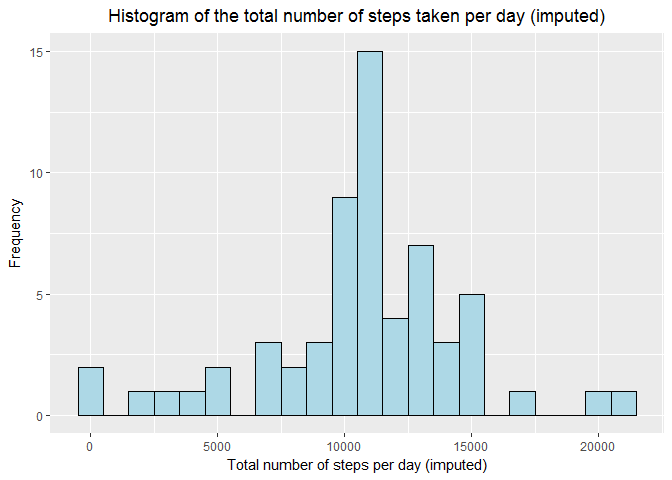
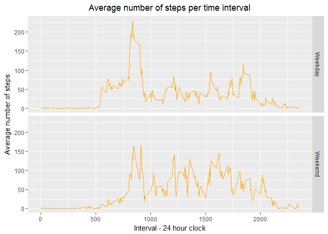

R Markdown
----------

    #assuming that you are in the correct working directory
    setwd('C:/Users/dale.stewart/datasciencecoursera/RR')
    stepsdata <- read.csv("C:/Users/dale.stewart/datasciencecoursera/RR/activity.csv")
    #change date field from factor to date
    stepsdata$date <- as.Date(as.character(stepsdata$date), "%Y-%m-%d")

What is the mean number of steps taken per day?
-----------------------------------------------

1.  Histogram of the total number of steps taken per day:

<!-- -->

    #take out NA values
    stepsdataNoNas <- stepsdata[complete.cases(stepsdata),]
    #aggregate the steps per day
    totalStepsPerDay <- aggregate(steps ~ date, stepsdataNoNas, sum)

    library(ggplot2)

    g <- ggplot(totalStepsPerDay, aes(x = steps)) + geom_histogram(fill="purple", binwidth = 1000, col = "black") + ylab("Frequency") + xlab("Total number of steps per day") + ggtitle("Histogram of the total number of steps taken per day") + theme(plot.title = element_text(hjust = 0.5))
    g

1.  Mean and median number of steps taken per day:

<!-- -->

    mean(totalStepsPerDay$steps)

    ## [1] 10766.19

    median(totalStepsPerDay$steps)

    ## [1] 10765

What is the average daily activity pattern?
-------------------------------------------

    #average by interval
    averageStepsPerInterval <- aggregate(stepsdataNoNas$steps, list(intervals = stepsdataNoNas$interval), mean)

    g <- ggplot(averageStepsPerInterval, aes(x = intervals, y = x)) + 
         geom_line(color = "green") + 
         xlab("Interval - 24 hour clock") +
         ylab("Average number of steps") +
         ggtitle("Average number of steps per time interval") +
         theme(plot.title = element_text(hjust = 0.5)) + 
         geom_vline(xintercept = averageStepsPerInterval[which.max(averageStepsPerInterval$x), "intervals"], color = "black",             linetype = "dashed")
    g

Which 5-minute interval, on average across all the days in the dataset,
contains the maximum number of steps?

    maxInterval <- averageStepsPerInterval[which.max(averageStepsPerInterval$x), "intervals"]
    maxInterval

    ## [1] 835

### Imputing missing values

1.  Calculate and report the total number of missing values in
    the dataset.

<!-- -->

    sum(is.na(stepsdata))

    ## [1] 2304

1.  Impute values using a reasonable method to fill in missing values.
    We are choosing to use the mean for each 5-minute interval.

<!-- -->

    intervalMean <- aggregate(stepsdata$steps, list(intervals = stepsdata$interval), mean, na.rm=TRUE)
    head(intervalMean, 5)

    ##   intervals         x
    ## 1         0 1.7169811
    ## 2         5 0.3396226
    ## 3        10 0.1320755
    ## 4        15 0.1509434
    ## 5        20 0.0754717

1.  Create a new datasetthat is equal to the original dataset but with
    the missing data filled in.

<!-- -->

    newstepsdata <- stepsdata
    for (i in 1:nrow(newstepsdata)){
         interval <- newstepsdata$interval[i]
         steps <- newstepsdata$steps[i]
         if(is.na(steps)){
              meanValue <- subset(intervalMean, intervalMean$intervals == interval)$x
              newstepsdata$steps[i] <- meanValue
         }
    }
    newstepsdata <- transform(newstepsdata, steps = as.integer(steps))
    head(newstepsdata)

    ##   steps       date interval
    ## 1     1 2012-10-01        0
    ## 2     0 2012-10-01        5
    ## 3     0 2012-10-01       10
    ## 4     0 2012-10-01       15
    ## 5     0 2012-10-01       20
    ## 6     2 2012-10-01       25

1.  Make a histogram of the total number of steps taken each day and
    calculate the mean and meduan total number of steps taken each day.
    Do these values differ from the estimates from the first part of the
    assignment? What is the impact of imputing missing data on the
    estiamtes of the total daily number of steps?

<!-- -->

    #aggregate the steps per day in new data set
    totalStepsPerDay <- aggregate(steps ~ date, newstepsdata, sum)

    g <- ggplot(totalStepsPerDay, aes(x = steps)) + geom_histogram(fill="light blue", binwidth = 1000, col = "black") + ylab("Frequency") + xlab("Total number of steps per day (imputed)") + ggtitle("Histogram of the total number of steps taken per day (imputed)") + theme(plot.title = element_text(hjust = 0.5))
    g

    mean(totalStepsPerDay$steps)

    ## [1] 10749.77

    median(totalStepsPerDay$steps)

    ## [1] 10641

Most of the NAs were imputed with zero which made the mean and median
lower in this instance.

Are there differences in activity patterns between weekdays and weekends?
-------------------------------------------------------------------------

1.  Create a new factor in the dataset with two levels (weekday
    and weekend) indicating whether a given date is a weekday or
    weekend day.

<!-- -->

    newstepsdata$day <- weekdays(newstepsdata$date)
    #boolean variable to see if weekday starts with an s
    newstepsdata$checkday <- grepl("^S", newstepsdata$day)
    newstepsdata$dayType <- factor(newstepsdata$checkday, levels = c(F, T), labels = c("Weekday", "Weekend"))

1.  Make a panel plot containing a time series plot (i.e. type = "l") of
    the 5-minute interval (x-axis) and the average number of steps
    taken, averaged across all weekday days or weekend days (y-axis).

<!-- -->

    averageNewStepsData <- aggregate(steps ~ interval + dayType, newstepsdata, mean)

    g <- ggplot(averageNewStepsData, aes(x = interval, y = steps)) + 
         facet_grid(dayType ~ .) +
         geom_line(color = "orange") + 
         xlab("Interval - 24 hour clock") +
         ylab("Average number of steps") +
         ggtitle("Average number of steps per time interval") +
         theme(plot.title = element_text(hjust = 0.5))
    g

There are several differences in the weekday vs weekend pattern in
steps. The subject definitely makes earlier moves during the weekdays
indicating an earlier wake time and associated movements with preparing
for the day. There is a larger spike at the 800 hour indicating perhaps
a walk to a office building or job site. In contrast during the weekend
the subject has more activity during the day indicating that they are
moving about more on the weekends than dring the week.
